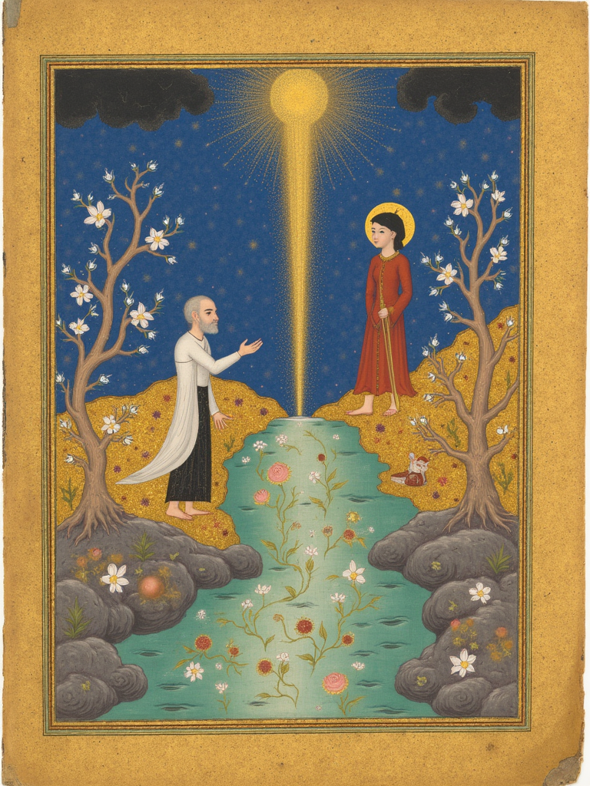
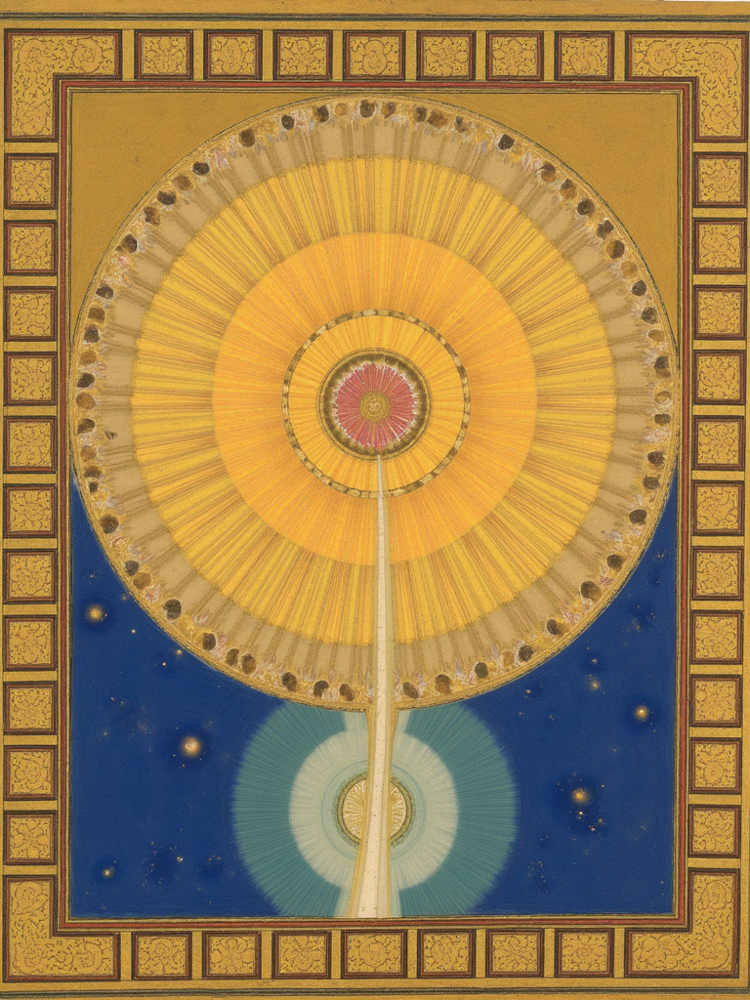
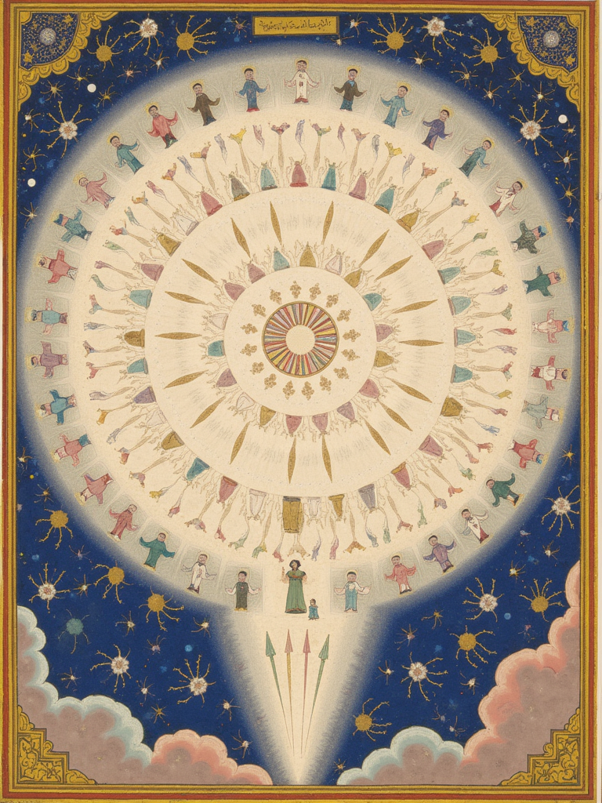

# Paradiso · Shahnameh

**Dante's *Paradiso* Canto XXX, retold as a Safavid manuscript page.**

The final canto of the *Divine Comedy* is pure light: a river of radiance that
straightens into a circle, a circle that opens into the great Celestial Rose of
the blessed. Dante reaches for the visual language of his own world to describe
it. This project reaches for another — the gold-ground, lapis-and-turquoise
idiom of **Persian miniature painting**, the *Shahnameh* manuscript tradition.

The story stays Dante. The picture becomes a Safavid folio.

## Play it — *Speak with Beatrice*

An interactive adaptation of *Paradiso* XXX where you stand in **Dante's** shoes and
talk, in your own words, to an **AI playing Beatrice**. She answers in character and
guides you through the vision — and what you say steers it: the illuminated Safavid
folio **paints itself** beat by beat (a river of light → a ring → the Celestial Rose →
the point of light with the angels wheeling) as your sight grows strong enough, and
**dims if you turn away**. **Play it live:**
[aryamehr2k.github.io/paradiso-shahnameh](https://aryamehr2k.github.io/paradiso-shahnameh/)

Beatrice is driven by the **Claude API** (model `claude-opus-4-8`), called from the
browser with structured output that controls the visualization. Because the site is
static, it's **bring-your-own-key**: click ⚙ and paste your own
[Anthropic API key](https://console.anthropic.com/settings/keys) — it's stored only in
your browser (localStorage) and sent directly to Anthropic, never committed. Without a
key, a short scripted version still plays.

We do it by training a small **style LoRA** on public-domain Persian-miniature
folios, then prompting **FLUX.1-dev** with the three beats of Canto XXX — the
river of light, its transformation into a rose, and the rose in full.

---

## The three panels

### I — The River of Light
> *"And I saw light in the form of a river / pouring its radiance between two banks / painted with the wonders of spring."*

The pilgrim and his radiant guide stand at a river of golden light; living
sparks rise from it like rubies and settle among the flowering banks.



### II — The River Becomes a Rose
> *"...so the river's length / became a round, the stream a rose of light."*

The straight river curves and closes on itself; the stream of radiance opens
into tiered, concentric petals of light.



### III — The Celestial Rose
> *"In fashion as a snow-white rose displayed / the saintly host..."*

Tier upon tier of blessed souls in a circular amphitheater of radiance, winged
messengers moving among them, a single point of light at the center.



---

## How it works

```
The Met (CC0 folios)  ──►  Flux LoRA  ──►  three Paradiso renders
   01_build_dataset.py     train_*.yaml      02_generate_paradiso.py
```

1. **Dataset** — `01_build_dataset.py` pulls ~45 public-domain Safavid /
   *Shahnameh* folios from **The Metropolitan Museum of Art** open-access API
   (CC0, no key). Each image gets a caption: a fixed style trigger
   (`shahnameh persian miniature style`) plus the Met's own title as the
   "content" half.

2. **Train** — `train_flux_persian.yaml` drives
   [ostris/ai-toolkit](https://github.com/ostris/ai-toolkit) to fit a rank-32
   LoRA on the FLUX.1-dev transformer (text encoder frozen — the style lives in
   the transformer). 2500 steps, ~5.5 h on the hardware below.

3. **Generate** — `02_generate_paradiso.py` loads the LoRA into a `diffusers`
   `FluxPipeline` and renders the three Canto XXX scenes as tall manuscript
   folios.

### Hardware / environment

Trained on an **NVIDIA DGX Spark (GB10, Blackwell, `sm_121`)**. Blackwell is new
enough that the setup has a few sharp edges, all handled in `setup_gb10.sh`:

- **cu130 nightly PyTorch** is required (`torch 2.12.0+cu130`); the
  `cuda capability 12.1 / max 12.0` warning is safe to ignore.
- **Do not install flash-attn** — it fails to build on GB10 and SDPA is faster
  here anyway.
- **No bitsandbytes 8-bit optimizer** — flaky on Blackwell; the config uses
  plain `adamw`.
- ai-toolkit pins `torchcodec` (no aarch64 wheel) — it's video-only and unused
  for image LoRA, so it's commented out of its `requirements_base.txt`.
- With `transformers>=5`, ai-toolkit's Flux sampler passes the empty
  unconditional prompt as `None`/`False`, which the new tokenizer rejects. A
  one-line coercion (non-string prompt → `""`) in `encode_prompt` fixes the
  step-0 sampling crash.

## Run it yourself

```bash
bash setup_gb10.sh                 # cu130 venv + ai-toolkit (see notes above)
source .venv/bin/activate
huggingface-cli login              # FLUX.1-dev is gated — accept its license first
python 01_build_dataset.py         # -> dataset/
python ai-toolkit/run.py train_flux_persian.yaml   # -> output/flux_persian_miniature/*.safetensors
python 02_generate_paradiso.py     # -> 01_river_of_light.png, 02_river_becomes_rose.png, 03_celestial_rose.png
```

---

## Attribution & license

- **Training images:** public domain (**CC0**) open-access works from
  **The Metropolitan Museum of Art**. No rights reserved; no attribution
  required, but gratefully given.
- **Base model:** **FLUX.1-dev** by Black Forest Labs, used under the
  **FLUX.1-dev Non-Commercial License**. The trained LoRA and all generated
  images inherit that non-commercial restriction.
- **Text:** Dante Alighieri, *Paradiso* Canto XXX (the poem is public domain;
  English lines above are loose paraphrase).
- **Code:** MIT (see [LICENSE](LICENSE)).

Because the base model is non-commercial, **this project is coursework /
research, not a commercial product.**
